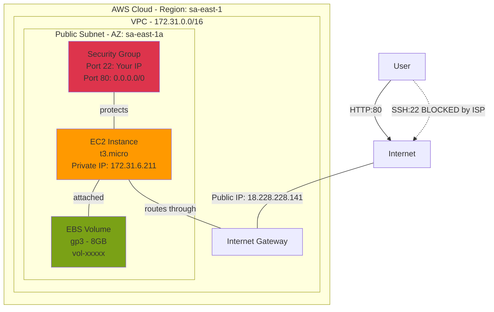
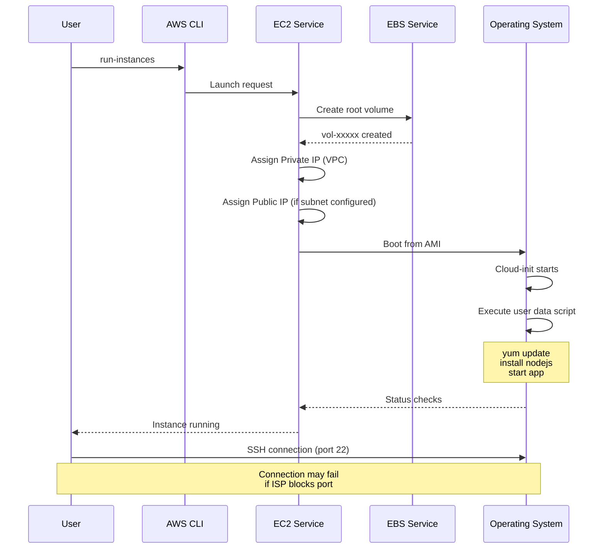
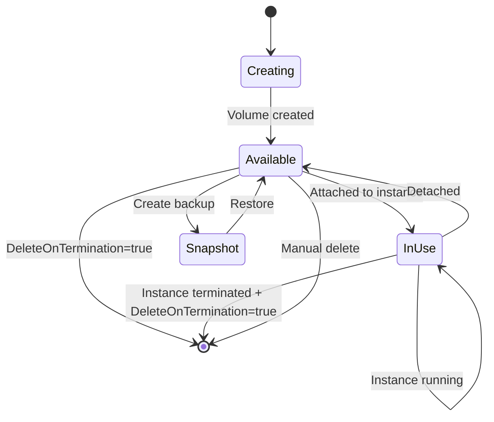

## EC2 Instance Components Diagram

## Instance Launch Flow

## EBS Lifecycle

<Callout type="warn">
By default, root volumes have `DeleteOnTermination=true`. Always check this setting for instances with important data.
</Callout>
